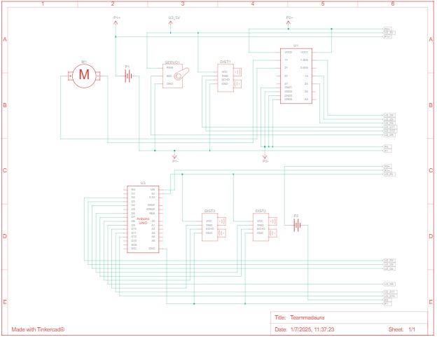

Diagramas electromecánicos
====

Este directorio debe contener uno o varios diagramas esquemáticos en formato JPEG, PNG o PDF de los componentes electromecánicos que ilustren todos los elementos (componentes electrónicos y motores) utilizados en el vehículo y cómo se conectan entre sí.

---

